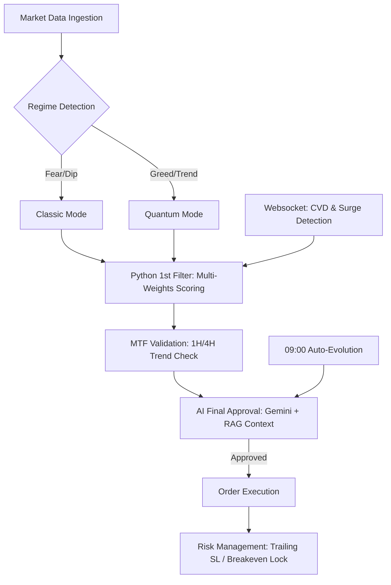

# 🚀 ATS-Xeon: AI-Driven Hybrid Algorithmic Trading System

**ATS-Xeon**은 거시 경제의 '날씨'를 스스로 파악하여 최적의 매매 무기를 자동으로 스위칭하고, 스스로의 전략 지침을 진화시키는 **차세대 완전 자동화 하이브리드(Hybrid) 트레이딩 엔진**입니다. 기술적 분석(TA)의 정밀함과 Google Gemini AI의 고도화된 전략 수립 능력을 결합하여, 인간의 개입 없는 자율 매매를 수행합니다.

---

## 🏗️ System Architecture

ATS-Xeon은 병렬 비동기(Asyncio) 구조를 기반으로 시상 상황에 따라 유연하게 대응합니다.



---

## 🧠 Core Philosophy: The Dual-Engine System

상충하는 시장 환경에서 수익을 극대화하기 위해, 공포/탐욕 지수(FGI)와 비트코인의 단기 추세를 분석하여 전략을 자동 전환합니다.

### 🛡️ 1. CLASSIC Mode (Deep Dip Sniper)
- **발동 조건:** FGI 35 이하 (공포장) 또는 비트코인 단기 하락세.
- **작전 철학:** 극단적 과매도 구간(RSI 저점 등)에서의 기술적 반등을 정밀 타격합니다.

### 🚀 2. QUANTUM Mode (Trend Breakout)
- **발동 조건:** FGI 65 이상 (탐욕장) 또는 비트코인 단기 상승세.
- **작전 철학:** 강력한 저항선 돌파 및 모멘텀 지속 구간을 추종하여 수익을 극대화합니다.

### 3. Hybrid Mode (Deep Dip + Trend Breakout)
- **발동 조건:** FGI 35 이하 (공포장) 또는 비트코인 단기 하락세.
- **작전 철학:** 시장 상황에 맞춰 클래식 모드와 퀀텀 모드를 자동으로 전환하여 수익을 극대화합니다.

---

## ✨ Advanced Infrastructure & Features

### 📡 Real-time Intelligence
- **CVD (Cumulative Volume Delta) Tracking**: 실시간 매수/매도 체결량을 누적하여 세력의 진입 강도를 선행 지표로 활용합니다.
- **BTC Surge Trigger**: 비트코인의 1분 내 격변(+1.5%) 감지 시 즉시 전 종목 딥스캔을 기동합니다.
- **RAG (Retrieval-Augmented Generation)**: 과거의 '최대 수익' 및 '뼈아픈 손실' 사례를 AI가 기억하여 동일한 실수를 방지합니다.
- **Dynamic FGI Scorer**: 공포/탐욕 지수에 따라 보조지표 가중치를 비선형(Quadratic)으로 자동 조절하여 시장 환경에 최적화된 점수를 산출합니다.

### 🔩 Robust Backend Control
- **Slippage Protection**: AI 승인 전 오더북(호가창)의 두께를 실시간 분석하여, 진입 시 발생할 가격 밀림을 예측하고 거래량이 부족한 종목을 필터링합니다.
- **Wait-and-Queue Scan Lock**: 자동 스캔과 수동 명령어 간의 충돌을 방지하며, 작업이 겹칠 경우 취소가 아닌 '순차 대기' 후 실행을 보장합니다.
- **Global API Semaphore**: 초당 API 호출 수를 10개로 제한하여 업비트의 429(Rate Limit) 차단을 완벽 방어합니다.
- **Tier-based Adaptive Control**: 코인의 변동성과 시총에 따라 **Major / High-Vol / Mid-Vol** 3단계로 분류하여 손절선과 타임아웃을 유동적으로 적용합니다.

### 🧬 Self-Evolution System
- **09:00 AI Evolution**: 매일 아침 전일 거래 데이터를 복기하여 `exit_plan_guideline` 프롬프트를 자동으로 재작성 및 진화시킵니다.
- **4H Self-Optimization**: 4시간 단위 승률 변화를 추적하여 손절선, 가중치 등 파라미터를 실시간 튜닝합니다.

---

## 🛠️ Maintenance & Safety
- **Watchdog 감시**: 메인 루프와 웹소켓의 생존 여부를 1분 단위로 체크하여 이상 시 즉시 텔레그램 알림을 발송합니다.
- **Log Management**: 10MB 단위 로깅 및 3일 이상 경과된 구형 로그 파일 자동 클린업 기능을 갖추고 있습니다.
- **Dual Config System**: `config_classic.json`과 `config_quantum.json`을 통해 모드별 독립적인 전략 파라미터를 관리합니다.
- **Buffered I/O (DB Flush)**: 모든 거래 데이터는 메모리에 임시 저장된 후 0.5초마다 일괄 저장되어 디스크 I/O로 인한 엔진 지연을 최소화합니다.

---

## 📱 Telegram Control Center

- `/보고` : 자산 현황, 누적 수익, 현재 엔진 모드 실시간 브리핑
- `/점수` : 감시 종목들의 펀더멘탈 점수 및 하드락(💀) 여부 확인
- `/시작` / `/정지` : 매매 엔진 가동 및 일시 중단
- `/매수` : 강제 정밀 딥스캔 1회 즉시 기동 (방어막 무시)
- `/매도` : 보유 전 종목 시장가 긴급 전량 청산
- `/최적화` : 최근 퍼포먼스 기반 AI 전략 수동 최적화

---

## 🚀 Installation

1. **환경 구축:**
   ```bash
   pip install pyupbit pandas_ta websockets google-genai aiosqlite requests
   ```
2. **설정:** `config_classic.json` 및 `config_quantum.json`에 API 키와 텔레그램 정보를 입력합니다.
3. **실행:**
   ```bash
   python ATS_Xeon.py
   ```

---

⚠️ **Disclaimer:** 본 프로젝트는 알고리즘 트레이딩 연구 목적으로 개발되었습니다. 실제 매매 시 발생하는 모든 금전적 손실에 대한 책임은 사용자 본인에게 있습니다.
